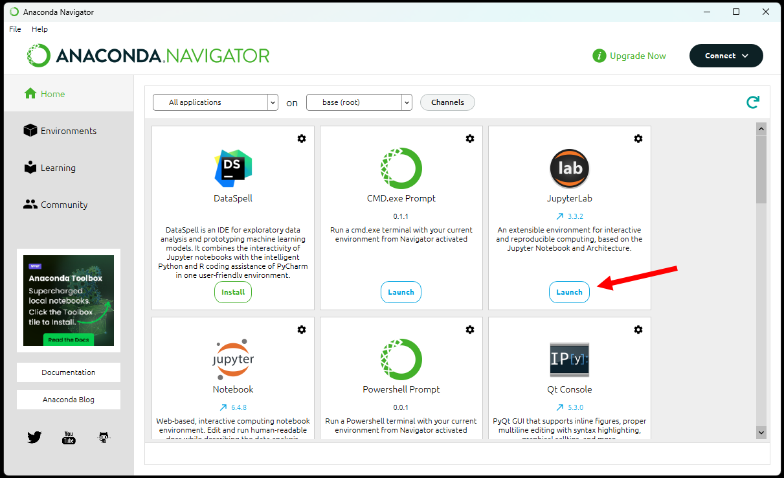
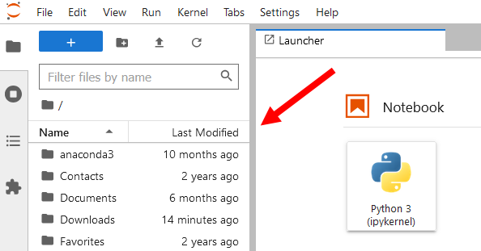
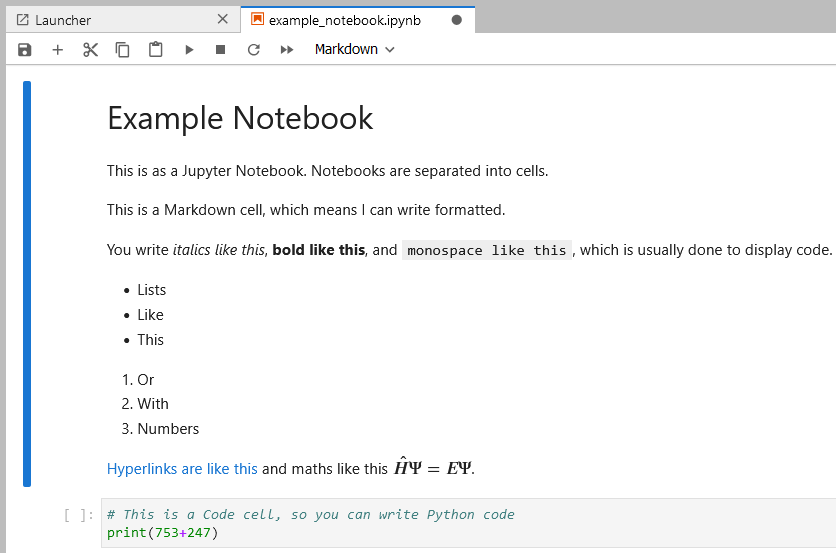
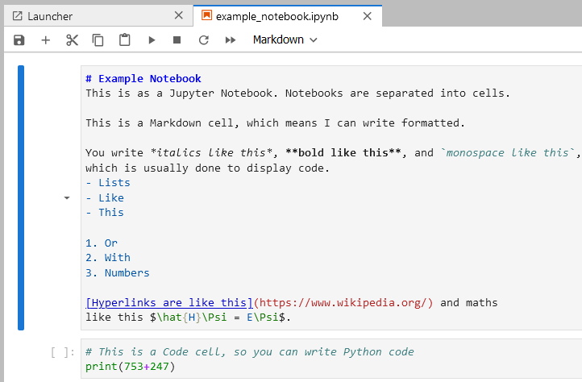

# Opening and Using a Jupyter Notebook
## Prerequisites
None.
## What is a Jupyter Notebook?
Some Python code is accompanied by text and images. This kind of code is stored in a file format called a _Jupyter Notebook_. You can recognise a Jupyter Notebook because the file name ends in `.ipynb`.
## How to open a Jupyter Notebook
If you don't already have a Jupyter Notebook file, you can download {Download}`this one<`example_notebook`.ipynb>`.
## Instructions
### Install Anaconda
Anaconda is a bundle of programs which can run and edit Python code. Check whether your computer has the program _Anaconda Navigator_. If not, **download Anaconda [here](https://www.anaconda.com/download/success).** If you are not sure which installer to download, choose the one from your operating system (Windows, Mac, or Linux), and select "Graphical Installer" if possible.

Once it is downloaded, **open the installer and follow the instructions**.

### Open JupyterLab
**Search for the program _Anaconda Navigator_ and open it**. After a few seconds, you should see a window like this appear:

**Press the "Launch" under JupyterLab.** This will open a tab on your default web browser which should look like this:

Look at the address bar at the top of your browser. It should read `localhost` followed by some numbers. This means that you are not actually accessing the internet, despite being on a web browser. The page is generated locally by your computer, so you don't need an internet connection to work on your Jupyter Notebook.

**In the sidebar on the left, search through your folders for your `.ipynb` file and double-click on it.** If you just downloaded this file, it might be in your _Downloads_ folder. Your screen should now show this:

You have just opened the Jupyter Notebook.

## How to use a Jupyter Notebook
Jupyter Notebooks are split into horizontal segments called _cells_. You can see which cell is selected because it has a vertical blue bar on the left of it, as you can see in the screenshot above. If you click on another part of the notebook, you will select another cell.

There are two important kinds of cells: _Markdown_ and _Code_.

You can tell what kind a cell is by looking at the top ribbon:

### Markdown cells
Markdown cells can contain formatted text and images. To change this content, **double-click on the cell**. This will show you the unformatted text, which has been written using a language called "Markdown":

To make the text appear formatted again, make sure that the cell is selected, and **click on the "Run" button in the top ribbon** (Shortcut: Shift + Enter):

### Code cells
Code cells contain programming code; in this case—Python. **Select the code cell, and run it, just like you ran the Markdown cell.** The result should look like this:

Observe how the output of the Python code (the number 1000) is printed below the cell. Additionally, a new empty code cell was created below, to let you continue writing code.

## Advice
Jupyter Notebooks are very good if you want someone else to use your code and your text in the same place. They also have a lot of options for being hosted online. Good uses for a Jupyter Notebook could be:
- A tutorial where you want to mix written instructions with runnable code.
- A data science report, where you generate figures along with the explanation for the origin of the data.
- A programme where you want the user to modify the source code, but they can't run Python on their own computer.

You should avoid using a notebook in these situations:
- You care about reproducibility: Notebook cells can be run in any order, and also deleted after running. All of this is information hidden from the user which could affect the results of the program.
- You are conducting a long-term project: Notebooks are not written in plain text (i.e. they don't look readable when opened in a notepad). Therefore, if you have multiple versions of one project, it's very hard to find exactly what the differences between versions are. In contrast, for plain text files, there are automatic tools for this.
- Your user doesn't need to see the source code: Notebooks always show you the original Python code which they are running. Usually, the user would prefer not to read this text before running a program because it is slow and pointless.

If you find yourself in any of these situations, you should prefer to write your code in a Python file, which is a plain text file ending in `.py`.
