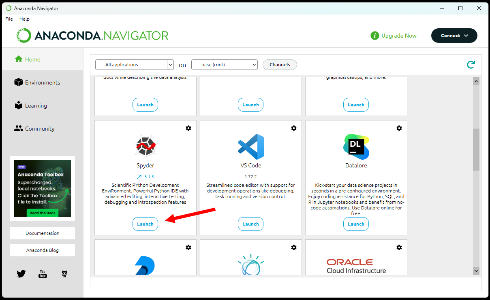
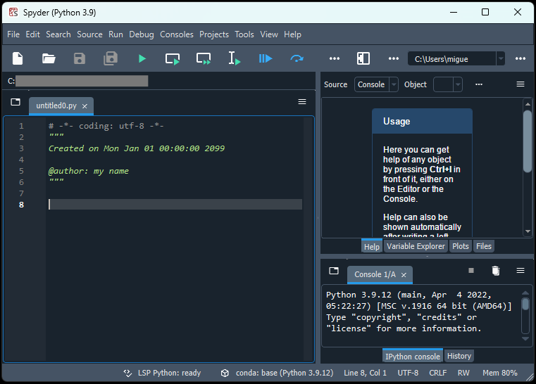
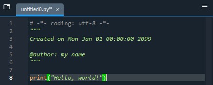
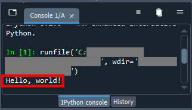

# Writing and Running a Python Program
## Prerequisites
None.
## What is a Python Program?
Python programs are sets of instructions that a computer can follow, written in a programming language called _Python_.

The Python programming language can be written on many platforms. The most common one is called a _Python program file_. This is a single plain text file ending with `.py`. You may also see them referred to as _scripts_ or _source code_. Once a Python program file is written, the user can ask the computer to follow the instructions within. This is called _running_ or _executing_ the program.

You can write such a file in any plain text editor (e.g. Notepad or TextEdit), but it is helpful to use an editor that can write and run your code in one same place. These are called _code editors_, or if they have more features, they are called an _Integrated Development Environment_ (IDE). For this lesson, we will use an IDE called _Spyder_.
# Instructions
## Install Anaconda
Anaconda is a bundle of programs which can run and edit Python code. Check whether your computer has the program _Anaconda Navigator_. If not, **download Anaconda [here](https://www.anaconda.com/download/success).** If you are not sure which installer to download, choose the one from your operating system (Windows, Mac, or Linux), and select "Graphical Installer" if possible.

Once it is downloaded, **open the installer and follow the instructions**.

## Open Spyder
**Search for the program _Anaconda Navigator_ and open it**. After a few seconds, you should see a window like this appear:



Scroll until you find the right button and **press the "Launch" under Spyder.** This will open window that should look this:



You may first see a pop-up suggesting to update Spyder. If so, click OK.

## Write a Python program
The left-hand pane is where you can write your program. **On line 8, paste the following text**:
```print("Hello, world!")```

It should look like this:



This one-line program tells the computer to repeat the words "Hello, world!" to us in writing.

Next, **save the program by pressing the "Save" button in the top ribbon** (Shortcut: Ctrl + S):


## Run a Python program
To run the program, **press the "Play" button in the top ribbon** (Shortcut: F5):


Anything that the computer writes as a result of the program is called an _output_. Read your output in the bottom-right pane:



# Advice
You should now be in a position to write Python programs, or open pre-existing ones using File-> Open (Shortcut: Ctrl+O) on Spyder. There are many other Python code editors that work very similarly, such as _Visual Studio Code_ or _PyCharm_.

Some Python code does not come in Python program files. The most popular alternative is the Jupyter Notebook, which Spyder is unable to open.

Some complex programming projects might involve multiple `.py` files which make reference to each other. In such cases, you may need those several files saved in the same folder for the program to run.

It is also possible to run Python programs without opening their source code, but the way to do this depends heavily on the kind of program it is and the computer it is running on.